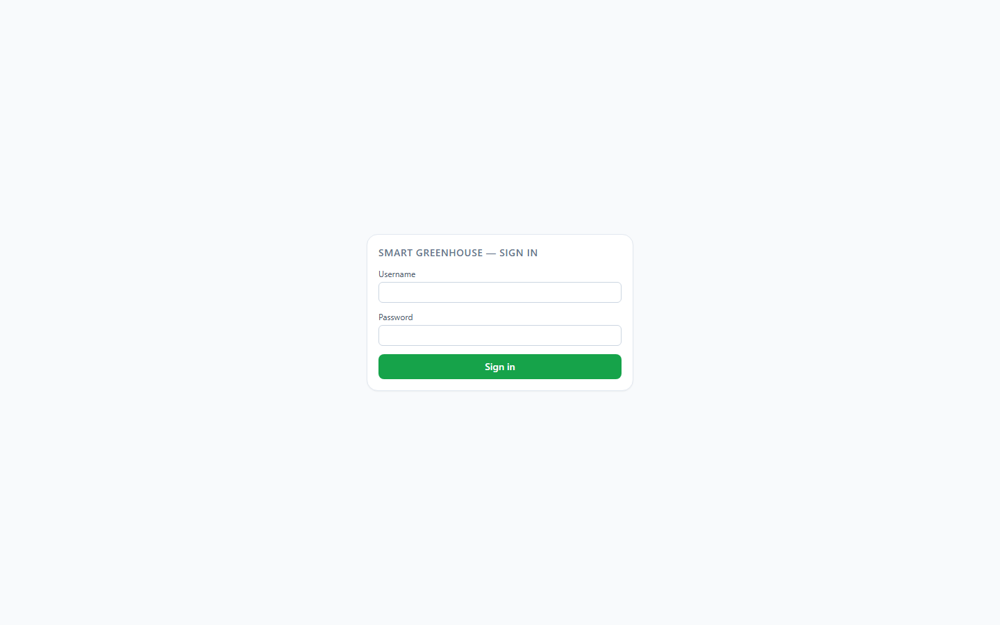
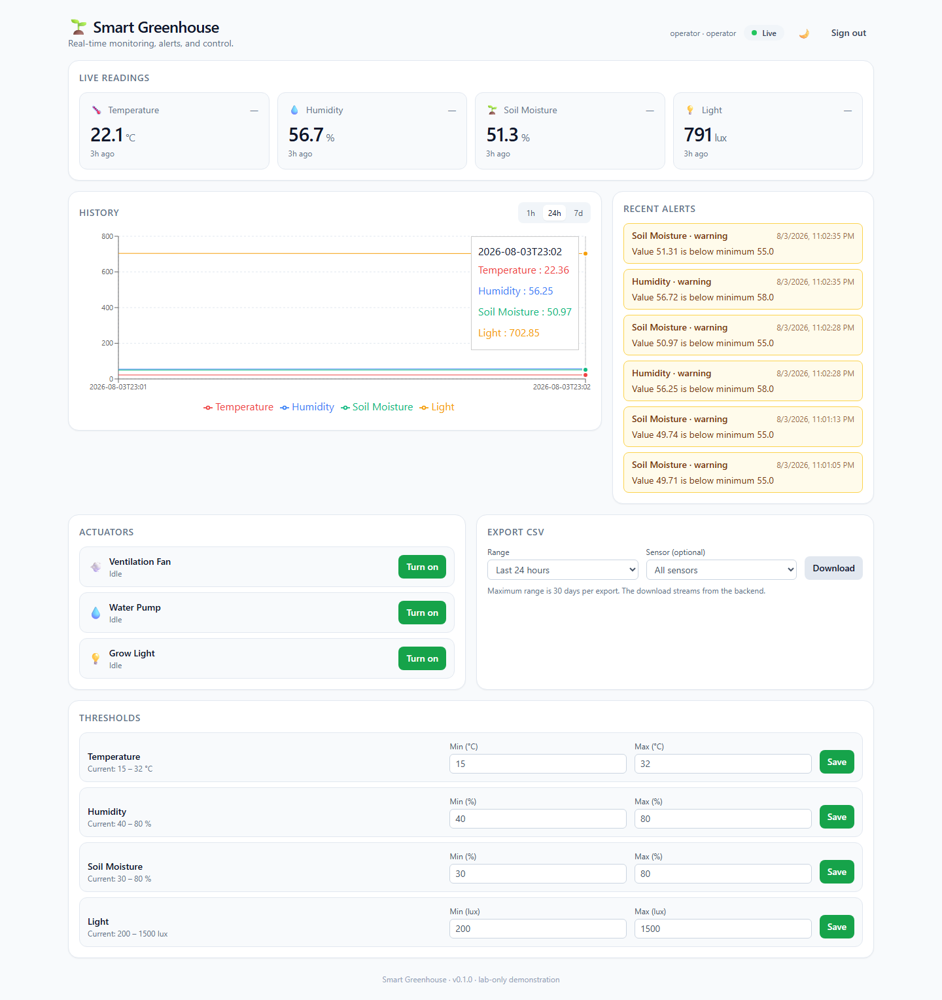
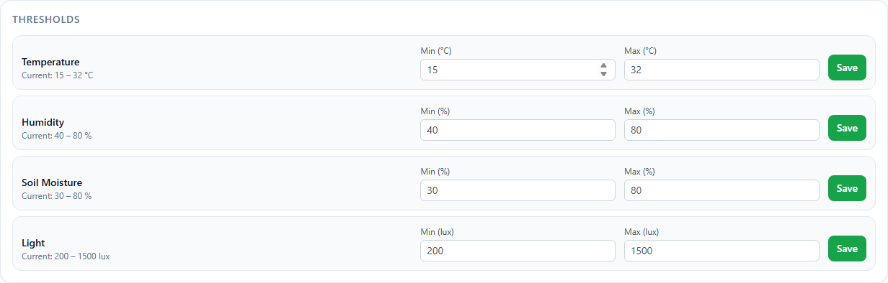
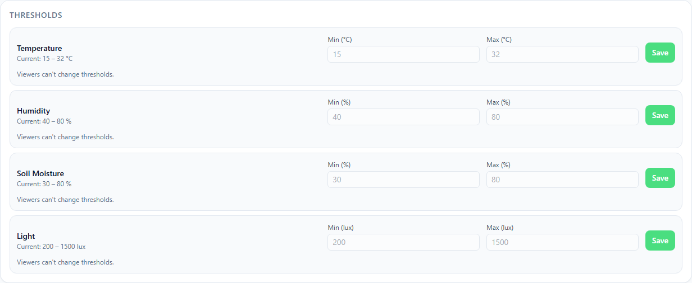
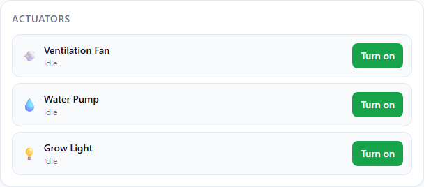

# Smart Greenhouse IoT Dashboard

> Full-stack IoT monitoring and control system for a smart greenhouse: real-time sensor telemetry, threshold-based alerting, manual actuator control, and CSV export — runnable end-to-end with **zero hardware** via a built-in sensor simulator, or with a real ESP32 node.

[](https://github.com/SeifMoussa/smart-greenhouse-iot-dashboard/actions/workflows/ci.yml)
[](https://github.com/SeifMoussa/smart-greenhouse-iot-dashboard/actions/workflows/codeql.yml)
[](LICENSE)
[](https://www.python.org/)
[](https://nodejs.org/)
[](https://www.typescriptlang.org/)
[](https://fastapi.tiangolo.com/)
[](https://react.dev/)
[](TESTING_REPORT.md)
[](TESTING_REPORT.md)

---

## Why I built this

I wanted one project that forced the browser, API, realtime channel, and device edge to agree on the same data model. The React dashboard is only useful if the FastAPI backend can accept telemetry, persist it, evaluate thresholds, and push the resulting state over WebSocket without making the UI guess. Starting with a simulator kept that flow testable before involving an ESP32, while the optional firmware made the IoT control scope concrete rather than just a dashboard mockup.

## What was harder than expected

The WebSocket path had more edge cases than the REST endpoints. Readings, alerts, and actuator changes can arrive while the dashboard is reconnecting, so the frontend hook needs backoff and the backend needs bounded connection accounting and predictable event types. Keeping simulator payloads, ESP32 payloads, API schemas, and React types aligned also exposed small documentation mismatches. The docs consistency check now compares links, commands, npm scripts, and documented routes with the repository so those fixes stay fixed.

---

## What this project demonstrates

This repository is an end-to-end IoT system built end-to-end by one engineer. It exercises a recruiter-relevant slice of full-stack and cybersecurity-adjacent skills:

- **Backend engineering** — FastAPI, SQLAlchemy 2 ORM, Pydantic v2 schemas, WebSocket broadcasting, structured JSON logging, JWT auth with viewer/operator roles, a separate device API key for sensor ingest, ingest and login rate limiting, async pub/sub event bus.
- **Frontend engineering** — React 18 + Vite + TypeScript (strict), Tailwind CSS, TanStack Query, Recharts, custom WebSocket hook with exponential-backoff reconnect, in-memory (not localStorage) auth token handling.
- **Testing discipline** — backend pytest and frontend Vitest suites, both covering the role-enforcement boundary (viewer blocked from writes, operator allowed) in addition to the feature logic. Every test in this repo was actually run; nothing in the testing report is fabricated.
- **DevSecOps** — Docker Compose three-service stack, multi-stage Dockerfiles, non-root containers, healthchecks, environment-driven configuration, secret-free defaults.
- **Cybersecurity awareness** — CORS hardened, ingest and login rate limited, parameterized queries, bcrypt password hashing, short-lived JWTs kept out of browser storage, role-based access control on every write endpoint, sanitized download filenames, lab-only disclaimer, npm-audit advisory triaged with documented rationale.
- **Engineering process** — development follows written specifications, with CI-grade quality checks (lint, format, typecheck, tests, build) run before work is declared complete.

---

## Features

- **User accounts with viewer/operator roles** — sign in with a username and password; viewers can see everything but can't change thresholds or actuators, operators can do both.
- **Live readings** for temperature, humidity, soil moisture, and light — value, unit, last-updated relative time, and an up / down / flat trend indicator per tile.
- **Historical chart** with 1 h / 24 h / 7 d range selector built on Recharts.
- **Alerts panel** with severity-coded entries (warning / critical) updated live via WebSocket.
- **Thresholds form** with client-side validation (`min < max`) and per-sensor `PUT`.
- **Actuator toggles** for fan, pump, and grow light with optimistic UI updates.
- **CSV export** for any time range and sensor type (server caps at 30 days per export).
- **WebSocket integration** for `reading`, `alert`, and `actuator` events, with exponential-backoff auto-reconnect.
- **Light / dark theme** persisted to `localStorage`, with system-preference fallback on first load.
- **Hardware-free demo** via the included simulator — clones, builds, and shows a live dashboard in minutes.

---

## Screenshots

<p align="center">
  
</p>

<p align="center">
  
</p>

*Operator view — live sensor readings, historical chart, recent alerts, actuator controls, and editable thresholds.*

| Operator (edit access) | Viewer (read-only) |
|---|---|
|  |  |

*Role-based access control in practice: the same Thresholds panel, rendered for each role. Viewers see live values but can't submit changes — enforced on the backend, not just hidden in the UI.*

<p align="center">
  
</p>

---

## Tech stack

| Layer | Stack |
|---|---|
| Frontend | React 18, Vite 5, TypeScript (strict, `noUncheckedIndexedAccess`), Tailwind CSS 3, Recharts 2, TanStack Query 5 |
| Backend | Python 3.11+, FastAPI, Pydantic v2, SQLAlchemy 2, SQLite |
| Realtime | FastAPI native WebSocket, in-process async pub/sub event bus |
| Simulator | httpx, bounded random walk, dependency-injectable HTTP client and sleep |
| Firmware (optional) | ESP32 + Arduino (DHT22 + analog soil moisture) |
| Tooling | Docker Compose, Make, Ruff (lint + format), Pytest (+ pytest-asyncio + coverage), ESLint 9 flat config, Prettier 3, Vitest 2, Testing Library, GitHub Actions |

---

## Architecture overview

```
                     ┌────────────────────────┐
                     │  React + Vite dashboard│  ◀──── browser
                     │   (served by nginx)    │
                     └───────────┬────────────┘
                                 │ REST + WS
                                 ▼
                     ┌────────────────────────┐
                     │       FastAPI          │
                     │  REST + WebSocket /ws  │
                     │  threshold evaluation  │
                     │  in-process event bus  │
                     └───────────┬────────────┘
                                 │
                 ┌───────────────┼───────────────┐
                 ▼               ▼               ▼
         ┌─────────────┐  ┌──────────────┐  ┌─────────────────┐
         │  SQLite     │  │  Simulator   │  │  Optional ESP32 │
         │ (named vol) │  │   POSTs      │  │   firmware      │
         └─────────────┘  └──────────────┘  └─────────────────┘
```

Full component-by-component flow: [`docs/ARCHITECTURE.md`](docs/ARCHITECTURE.md).

---

## Quick start — without Docker

Prerequisites: Python 3.11+ and Node 20+ on the host.

```bash
git clone https://github.com/SeifMoussa/smart-greenhouse-iot-dashboard.git
cd smart-greenhouse-iot-dashboard
cp .env.example .env

# Install both stacks
make install
```

Then in three terminals:

```bash
# Terminal 1 — backend on :8000
make dev-backend

# Terminal 2 — simulator pushing synthetic readings every 5 s
make dev-simulator

# Terminal 3 — frontend dev server on :5173
make dev-frontend
```

Open <http://localhost:5173> and sign in with one of the seeded demo accounts (from `.env.example`): `operator` / `operator123` for full control, or `viewer` / `viewer123` for read-only access. Change these before running anywhere but a local demo.

---

## Quick start — with Docker

> **Status:** Docker support is implemented and config-validated. Runtime verification is pending on a machine with container-registry access (my dev machine's network blocks Docker Hub). The full smoke test is automated in [`scripts/verify-docker.sh`](scripts/verify-docker.sh). See [`docs/DEPLOYMENT.md`](docs/DEPLOYMENT.md) for the verification status and the exact commands.

```bash
git clone https://github.com/SeifMoussa/smart-greenhouse-iot-dashboard.git
cd smart-greenhouse-iot-dashboard
docker compose up --build
```

Then open <http://localhost:5173> and sign in with the seeded `operator` / `operator123` or `viewer` / `viewer123` account. To verify end-to-end with one command:

```bash
./scripts/verify-docker.sh
```

---

## Commands cheat sheet

All Makefile targets (run `make help` for an aligned list):

### Install

```bash
make install            # both stacks
make install-backend    # pip install -e ".[dev]"
make install-frontend   # npm ci
```

### Dev servers

```bash
make dev-backend        # uvicorn 'greenhouse.main:create_app' --factory --reload
make dev-simulator      # python -m greenhouse.simulator
make dev-frontend       # vite
```

### Tests

```bash
make test               # backend + frontend
make test-backend       # pytest with coverage and 70 % gate
make test-frontend      # vitest --run
```

### Lint / format / typecheck

```bash
make lint               # ruff check + eslint
make format             # ruff format + prettier --write
make format-check       # verify formatting (ruff format --check + prettier --check)
make typecheck          # tsc --noEmit (frontend)
```

### Build

```bash
make build              # frontend production bundle
```

### Docker Compose

```bash
make up                 # docker compose up --build
make down               # docker compose down
make logs               # docker compose logs -f
```

### Direct backend / frontend commands

If you prefer running tools directly:

```bash
# Backend
cd backend
pip install -e ".[dev]"
ruff check src tests
ruff format --check src tests
pytest --cov=greenhouse --cov-report=term-missing
uvicorn 'greenhouse.main:create_app' --factory --reload --host 0.0.0.0 --port 8000

# Simulator (from backend/)
python -m greenhouse.simulator

# Frontend
cd frontend
npm ci
npm run lint
npm run format:check
npm run typecheck
npm test -- --run
npm run build
npm run dev
```

---

## Project structure

```
smart-greenhouse-iot-dashboard/
├── backend/                    FastAPI service + simulator + tests
│   ├── src/greenhouse/         Application package
│   │   ├── routes/             health, readings, thresholds, alerts,
│   │   │                       actuators, export, ws_route
│   │   ├── config.py           Pydantic-Settings env loader
│   │   ├── db.py               Engine, session factory, defaults seeding
│   │   ├── models.py           SQLAlchemy 2 ORM models
│   │   ├── schemas.py          Pydantic v2 request/response schemas
│   │   ├── event_bus.py        In-process async pub/sub
│   │   ├── thresholds.py       Pure-function threshold evaluation
│   │   ├── rate_limit.py       Token-bucket limiter
│   │   ├── ws.py               WebSocket slot accounting
│   │   ├── deps.py             FastAPI dependency providers
│   │   ├── main.py             create_app() factory
│   │   └── simulator.py        Synthetic sensor simulator CLI
│   ├── tests/                  109 pytest tests, 96 % coverage
│   ├── pyproject.toml          Deps + ruff + pytest config
│   └── Dockerfile              Multi-stage, non-root, healthcheck
├── frontend/                   React + Vite + TS dashboard
│   ├── src/
│   │   ├── api/                Typed REST client + endpoints
│   │   ├── components/         Feature components + UI primitives
│   │   ├── hooks/              useTheme, useWebSocket, useGreenhouseSocket
│   │   ├── pages/Dashboard.tsx Composed view
│   │   ├── types/api.ts        Schemas mirrored from backend
│   │   └── main.tsx, App.tsx, index.css
│   ├── tests/                  37 Vitest tests
│   ├── package.json
│   ├── Dockerfile              Multi-stage Node → nginx alpine
│   └── nginx.conf              SPA fallback, cache, /healthz
├── firmware/greenhouse_esp32/  Optional ESP32 device-integration sketch
├── docs/                       Architecture, API, Hardware, Deployment, Data Model
├── examples/                   Runnable command recipes
├── scripts/verify-docker.sh    End-to-end Docker smoke test
├── docker-compose.yml          3-service stack with named volume
├── .github/                    Issue / PR templates, dependabot
├── Makefile
├── LICENSE
├── CHANGELOG.md
├── TESTING_REPORT.md
└── README.md
```

---

## Documentation index

- [`docs/ARCHITECTURE.md`](docs/ARCHITECTURE.md) — components, data flow, design decisions
- [`docs/API.md`](docs/API.md) — REST + WebSocket reference with curl examples
- [`docs/HARDWARE.md`](docs/HARDWARE.md) — optional ESP32 wiring and parts list
- [`docs/DEPLOYMENT.md`](docs/DEPLOYMENT.md) — local + Docker setup, troubleshooting, runtime-verification status
- [`docs/DATA_MODEL.md`](docs/DATA_MODEL.md) — database schema and conventions
- [`firmware/README.md`](firmware/README.md) — firmware notes and simulator-first recommendation
- [`examples/README.md`](examples/README.md) — copy-pasteable command recipes
- [`TESTING_REPORT.md`](TESTING_REPORT.md) — real test results, every command actually run
- [`CONTRIBUTING.md`](CONTRIBUTING.md) — dev setup and contribution guidelines
- [`CHANGELOG.md`](CHANGELOG.md) — Keep-a-Changelog history

---

## Known limitations

- **Docker runtime verification pending.** Implementation is complete and config-validated; the live `docker compose up` must be run on a machine with normal container-registry access. See [`docs/DEPLOYMENT.md`](docs/DEPLOYMENT.md).
- **Lab telemetry.** The simulator is the default data source, and the optional ESP32 sketch demonstrates a single-node integration rather than production hardware at scale.
- **Portfolio/lab scope.** This is not a commercial greenhouse platform. It has no enterprise device enrollment, fleet inventory, certificate rotation, remote firmware management, or per-device authorization.
- **Limited deployment hardening.** No HTTPS termination, production secrets service, distributed event bus, high-availability database, backup policy, or operational monitoring is included. SQLite and the in-process WebSocket event bus are intentionally single-instance choices.
- **Frontend bundle is one 583 kB chunk.** Recharts is the bulk of it; `manualChunks` splitting is a future improvement.
- **Frontend dependency advisories.** `npm audit` reports findings in the development toolchain; they need compatibility review rather than an automatic force-upgrade.
- **No E2E browser tests yet.** Coverage is unit + component + hook level on the frontend.
- **No refresh-token flow.** JWTs expire after 60 minutes and a page refresh always signs you out, since the token lives in memory rather than any browser storage. Both are deliberate tradeoffs for this scope, documented in [`docs/ARCHITECTURE.md`](docs/ARCHITECTURE.md).

---

## What I would improve next

I would give each ESP32 its own identity and credential, then move telemetry fan-out from the in-process event bus to a broker so multiple backend instances can share device state. On the dashboard side, I would add a browser-level test that follows one reading from ingestion through the WebSocket update to the chart and alert panel. A hardened deployment example with TLS, managed persistence, secrets injection, and basic metrics would make the Docker setup more representative without pretending it is already an operations platform.

## How to verify it works

Install both development stacks, then run the repository's backend, frontend, build, and documentation checks:

```bash
make install
make test-backend
make test-frontend
make lint
make format-check
make typecheck
make build
python scripts/check-docs.py
```

For the full simulated telemetry flow on a Docker-capable machine:

```bash
docker compose up --build
./scripts/verify-docker.sh
docker compose down
```

The Docker commands exercise the React dashboard, FastAPI API, simulator, and WebSocket flow together. They are a lab verification path, not evidence of production deployment readiness.

---

## Lab-only disclaimer

This project is designed for **local lab use, education, and portfolio demonstration**. It is not hardened for public-internet exposure and ships with permissive defaults appropriate for a development environment (open read endpoints, in-process event bus, single-tenant SQLite). Do not deploy as-is to production or expose to untrusted networks.

---

## License

MIT — see [LICENSE](LICENSE).

---

## Why this project (for recruiters)

This repository is a complete, runnable engineering artifact rather than a tutorial walk-through. Every visible piece — REST contract, WebSocket protocol, simulator behaviour, tests, Docker stack, documentation — was specified, implemented, and verified in sequence with phase-gated quality checks. The testing report contains the actual commands and outputs from each phase, so the green badges above are claims I can defend, not decoration.

What it shows about the way I work:
- I write requirements before code.
- I write tests alongside features and refuse to declare something "done" without running the tests.
- I keep cybersecurity considerations on the same level as feature work (CORS, rate limiting, role-based access control, password hashing, secret-free defaults, audit triage).
- I write honest documentation: the Docker section explicitly notes runtime verification is pending rather than fabricating screenshots.
- I leave a clean engineering trail (changelog, testing report) so a code reviewer can audit the project without needing to talk to me first.
